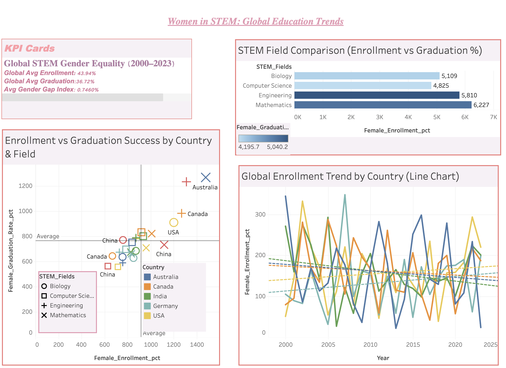

# 👩‍🔬 Women in STEM: Global Education Trends (2000–2023)

### 🌍 Overview  
This Tableau project visualizes **two decades of global trends in women’s participation in STEM education** (Science, Technology, Engineering, and Mathematics) across six major countries — *Australia, Canada, China, Germany, India,* and *the USA*.  

The analysis focuses on **female enrollment rates, graduation outcomes, and gender parity (0–1 Gender Gap Index)** to reveal where equality has progressed — and where disparities remain.

🔗 **Live Dashboard:** [View on Tableau Public](https://public.tableau.com/views/WomeninSTEMGlobalEducationTrends/Dashboard1)  
📊 **Dataset:** [Women’s Representation in Global STEM Education (2000–2023)](https://www.kaggle.com/datasets/bismasajjad/womens-representation-in-global-stem-education/data)

---

## 📈 Analytical Goals
- Examine **country-level progress** in gender parity across 24 years.  
- Compare **STEM disciplines** (Engineering, Computer Science, Biology, Mathematics).  
- Measure correlation between **enrollment and graduation** to identify retention gaps.  
- Track **Gender Gap Index trends** to assess parity progress toward 1.0.  

---

## 🧠 Key Insights

### 🌎 Global View  
- Average female STEM **enrollment = 43.9%**  
- Average female **graduation = 36.7%**  
- **Global Gender Gap Index = 0.74**, showing gradual progress but not yet equality.  

### 🎓 Country-Level Trends  
- 🇦🇺 **Australia** and 🇨🇦 **Canada** lead in gender parity (Gap Index > 0.9).  
- 🇮🇳 **India** and 🇨🇳 **China** show rapid growth post-2010 due to national STEM initiatives.  
- 🇩🇪 **Germany** remains stable but low in female enrollment, particularly in engineering.  

### ⚙️ Field-Level Insights  
- **Biology** and **Mathematics** have the highest female representation.  
- **Engineering** and **Computer Science** remain the least gender-balanced.  
- The retention gap from enrollment to graduation highlights persistent structural barriers.  

### 📊 Correlation Highlights  
- Strong positive relationship between **enrollment and graduation** — early access predicts success.  
- However, **Engineering** shows weaker correlation, reflecting higher dropout rates among women.  

---

## 🧩 Dashboard Breakdown

| Section | Visualization | Purpose |
|----------|----------------|----------|
| 🌍 **KPI Cards** | Global averages for enrollment, graduation, and gender gap | Snapshot of overall parity progress |
| 📈 **Gender Gap Index Trend** | Line chart | Tracks equality progress (Closer to 1 = parity) |
| 🧮 **STEM Field Comparison** | Bar chart | Compares enrollment and graduation by discipline |
| 🎯 **Enrollment vs Graduation Scatter** | Bubble plot | Reveals country-field correlation |
| 📊 **Global Enrollment Trend** | Multi-line chart | Long-term participation analysis by country |

---

## 🧰 Tools & Techniques

| Tool | Purpose |
|------|----------|
| **Tableau Public** | Data visualization & dashboard design |
| **Pandas / NumPy (Python)** | Pre-cleaning & statistical summaries |
| **Kaggle Dataset (UNESCO / OECD)** | Verified education & gender data |
| **Excel / Power Query** | Data wrangling and normalization |

---

## 🖼 Dashboard Preview  

---

## 💡 Key Takeaways
- 🌏 Gender parity in STEM is improving, but **discipline-specific inequality persists**.  
- 🎓 **Graduation rates lag behind enrollment**, indicating retention challenges.  
- ⚙️ Emerging economies are catching up rapidly, while developed nations face cultural barriers in tech and engineering.  
- 💬 Sustainable equality requires policies beyond access — focused on retention, mentorship, and institutional culture.

---

## 🚀 Future Work
- Add **time-series forecasting** to project parity trends to 2030.  
- Build **interactive parameter filters** for field and region selection.  
- Develop a **Power BI version** for cross-platform analytics comparison.

---

## 👩‍💻 Author
**Mariam Lulu Mohammed**  
🎓 BSc Artificial Intelligence & Computer Science — *University of Birmingham Dubai*  
📫 [LinkedIn](https://linkedin.com/in/mariamlulumohammed) • [GitHub](https://github.com/mariamlulu)

## 🏷 Tags
`#Tableau` `#DataVisualization` `#Analytics` `#WomenInSTEM` `#GenderEquality` `#DataScience` `#PortfolioProject`
